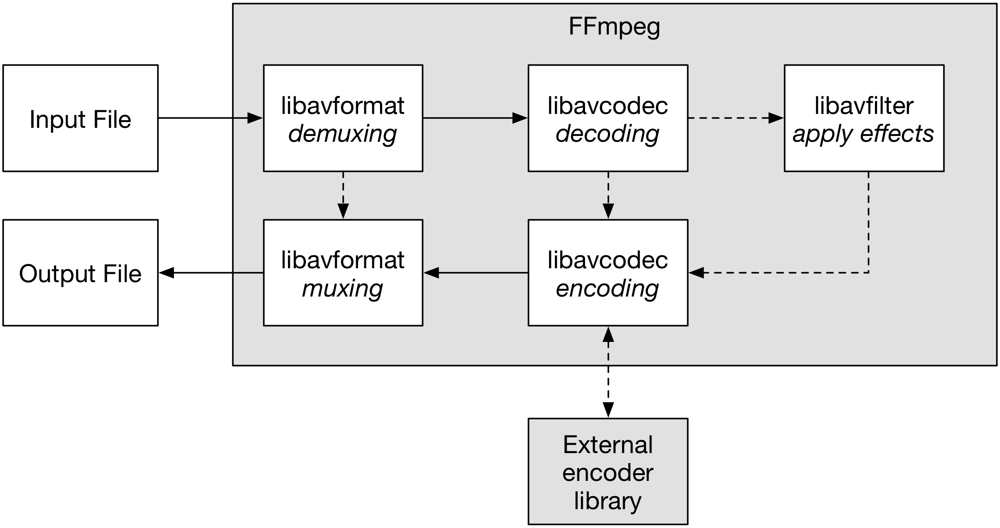
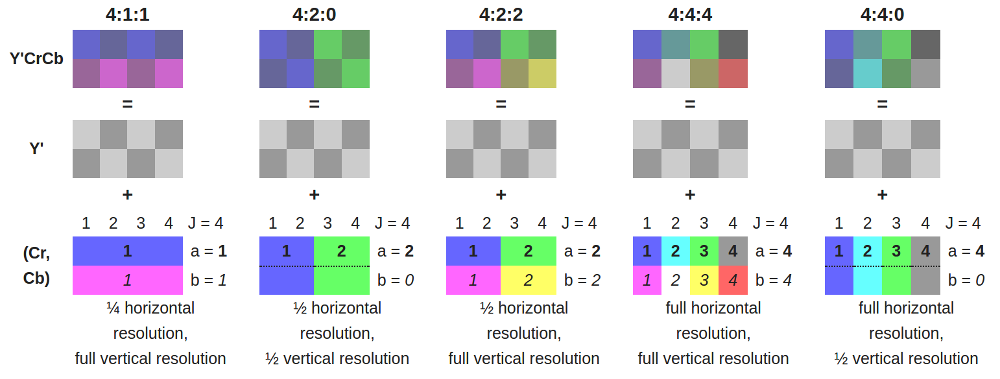
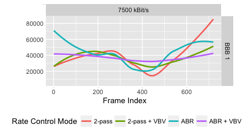
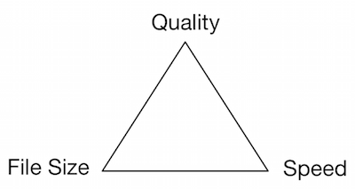

<style type="text/css">
h1, h2, h3, h4, h5, p, pre, code {
    text-align: left
}
.reveal {
    font-size: 28px;
}
.reveal pre code {
    font-size: 18px;
    line-height: 22px;
}
.reveal p code,
.reveal li code {
    font-size: 24px;
}
.reveal ul, .reveal ol {
    display: block;
}
.reveal img {
  border: 0 !important;
  box-shadow: none !important;
}
</style>


# FFmpeg Encoding and Editing Course

<!-- .slide: data-background-color="#006600" -->

Werner Robitza  
June 21, 2017

---

## About me

* Researcher at T-Labs of Deutsche Telekom in Berlin
* PhD student at Technische Universität Ilmenau

Contact:

* `werner.robitza@gmail.com`
* http://slhck.info
* `@slhck`

---

## Goals

You should learn:

* Basic concepts
* Installing ffmpeg and tools
* Encoding videos
* Appling filters
* Analyzing videos

---

## Requirements

* These slides
* `ffmpeg`, `ffprobe` and `ffplay` installed
* Some sample videos, example: [Big Buck Bunny](http://distribution.bbb3d.renderfarming.net/video/mp4/bbb_sunflower_1080p_60fps_normal.mp4)

---

## Resources

If you need sample videos for testing, see overview from VQEG  
(Video Quality Experts Group):

https://www.its.bldrdoc.gov/vqeg/video-datasets-and-organizations.aspx


---

# Introduction to FFmpeg

<!-- .slide: data-background-color="#333333" -->

---

## About the Project


* Free, open-source software for multimedia editing, conversion, …
* Started in 2000
* Continuous development until now

Similar or related (and useful) frameworks:

* [ImageMagick](https://www.imagemagick.org/)
* [MLT Framework](https://www.mltframework.org/)

---

## Tools

FFmpeg contains:

* Command-line tools: `ffmpeg`, `ffprobe`, `ffserver`, `ffplay`
* Libraries: `libavformat`, `libavcodec`, `libavfilter`, …

Libraries are used in many projects (VLC, MLT Framework, …)

---

## About the Libraries (`libav*`)

* `libavformat`: Reads and writes container formats (AVI, MKV, MP4, …)
* `libavcodec`: Reads and writes codecs (H.264, H.265, VP9, …)
* `libavfilter`: Various filters for video and audio
* ... and many more

Examples on how to programmatically use libraries: http://leixiaohua1020.github.io/#ffmpeg-development-examples

---

## Architecture

Simplfied overall architecture:



---

## Installation / Compilation

Installation Method                               | Pro                               | Con
------------------------------------------------- | --------------------------------- | ---------------------------------
Building from source                              | Offers all options, tools, codecs | Takes time, hard to update
Downloading static build                          | Easy and fast                     | Does not offer all encoders, manual update
Installing from package manager (e.g., `apt-get`) | Easy and fast                     | Does not always offer latest version or all encoders

* Get source code and static builds from: http://ffmpeg.org/download.html
* Building on Windows: https://github.com/jb-alvarado/media-autobuild_suite

---

## Getting Help

Places to get help:

* 📖 Documentation: https://ffmpeg.org/ffmpeg-all.html
* 📖 Wiki: http://trac.ffmpeg.org/wiki
* 📖 IRC: `#ffmpeg`
* ✉ Mailing list: https://lists.ffmpeg.org/mailman/listinfo/ffmpeg-user/
* 🌐 Stack Overflow: https://stackoverflow.com/ and use `#ffmpeg`
* 🌐 Super User: http://superuser.com/ and use `#ffmpeg`
* … or ask me

---

# General Video Encoding Concepts

<!-- .slide: data-background-color="#333333" -->

---

## Container Formats

Containers *contain* media data. Typical examples:

* MP4: MPEG-4 Part 14 container for H.264, H.264, AAC audio, …
* MKV: Versatile container for any media format
* AVI: Legacy container

See supported containers with:

```
$ ffmpeg -formats
File formats:
 D. = Demuxing supported
 .E = Muxing supported
 --
 D  3dostr          3DO STR
  E 3g2             3GP2 (3GPP2 file format)
  E 3gp             3GP (3GPP file format)
 D  4xm             4X Technologies
  E a64             a64 - video for Commodore 64
 D  aa              Audible AA format files
 ...
```

---

## Codecs

* CODEC = *Co*der / *Dec*oder
* Specification on how to code and decode video, audio, …
* Usually **not** a specification on how to encode / compress data

See supported codecs with:

```
$ ffmpeg -codecs
Codecs:
 D..... = Decoding supported
 .E.... = Encoding supported
 ..V... = Video codec
 ..A... = Audio codec
 ..S... = Subtitle codec
 ...I.. = Intra frame-only codec
 ....L. = Lossy compression
 .....S = Lossless compression
 -------
 D.VI.. 012v                 Uncompressed 4:2:2 10-bit
 D.V.L. 4xm                  4X Movie
 D.VI.S 8bps                 QuickTime 8BPS video
 .EVIL. a64_multi            Multicolor charset for Commodore 64 (encoders: a64multi )
 .EVIL. a64_multi5           Multicolor charset for Commodore 64, extended with 5th color (colram) (encoders: a64multi5 )
 D.V..S aasc                 Autodesk RLE
 D.VIL. aic                  Apple Intermediate Codec
...
```

---

## Most Important (Lossy) Codecs

Currently mostly used, standardized by ITU/ISO:

* 🎥 H.262 / MPEG-2 Part H: Broadcasting, TV, used for backwards compatibility
* 🎥 H.264 / MPEG-4 Part 10: The de-facto standard for video encoding today
* 🎥 H.265 / MPEG-H: Successor of H.264, up to 50% better quality
* 🔊 MP3 / MPEG-2 Audio Layer III: Used to be the de-facto audio coding standard
* 🔊 AAC / ISO/IEC 14496-3:2009: Advanced Audio Coding standard

Competitors that are royalty-free:

* 🎥 VP8: Free, open-source codec from Google
* 🎥 VP9: Successor to VP8, almost as good as H.265
* 🎥 AV1: Currently in development as a successor to VP9

---

## Most Important Lossless Codecs

Lossless codecs are useful for archival, editing, ...

* 🎥 Raw YUV, HuffYUV, FFV1, …
* 🔊 Raw PCM, FLAC, ALAC, …

Also, "visually lossless" codecs exist:

* 🎥 Apple ProRes, Avid DNxHD, JPEG2000, high-quality H.264/H.265, ...
* High bitrate and usually only I-frames

---

## Encoders

* Encoders are the *actual* software that outputs a codec-compliant bitstream
* Encoders can vary in quality and performance

Examples:

* 🎥 libx264: most popular free and open-source H.264 encoder
* 🎥 NVENC: NVIDIA GPU-based H.264 encoder
* 🎥 libx265: free and open-source HEVC encoder
* 🎥 libvpx: VP8 and VP9 encoder from Google
* 🔊 libfdk-aac: AAC encoder
* 🔊 `aac`: native FFmpeg AAC encoder
* …

→ lots of competition

---

## Encoders supported in FFmpeg

```
$ ffmpeg -encoders
Encoders:
 V..... = Video
 A..... = Audio
 S..... = Subtitle
 .F.... = Frame-level multithreading
 ..S... = Slice-level multithreading
 ...X.. = Codec is experimental
 ....B. = Supports draw_horiz_band
 .....D = Supports direct rendering method 1
 ------
 V..... a64multi             Multicolor charset for Commodore 64 (codec a64_multi)
 V..... a64multi5            Multicolor charset for Commodore 64, extended with 5th color (colram) (codec a64_multi5)
 V..... alias_pix            Alias/Wavefront PIX image
...
```

---

## Pixel Formats

* Representation of raw pixels in video streams
* Specifies order of luma/color components and chroma subsampling



<small>Image Source: [Wikipedia](https://en.wikipedia.org/wiki/Chroma_subsampling)</small>

Supported  pixel formats: `ffmpeg -pix_fmts`

---

## Exercise 1

<!-- .slide: data-background-color="#660000" -->

Tasks:

* Download a PNG image from the Web
* Run the following command:

        ffmpeg -loop 1 -i <image> -t 5 output.mp4

Questions:

* What codec and encoder are auto-selected for the output file?
* What pixel format is auto-selected by ffmpeg?
* Why do you think this is done?

---

# Encoding with the `ffmpeg` Command Line Tool

<!-- .slide: data-background-color="#333333" -->

---

## General syntax

```bash
ffmpeg <global-options> <input-options> -i <input> <output-options> <output>
```

* Global options for log output, file overwriting, ...
* Input options for reading files
* Output options for:
    * conversion (codec, quality, ...)
    * filtering
    * stream mapping
    * …

Full help: `ffmpeg -h full` or `man ffmpeg`

---

## Transcoding and Transmuxing

Transcoding from one codec to another:

```bash
ffmpeg -i <input> -c:v libx264 output.mp4
```

Transmuxing from one container/format to another – without re-encoding:

```bash
ffmpeg -i input.mp4 -c copy output.mkv
```

ffmpeg will take one video, audio, and subtitle stream from the input and map it to the output.

Explanation:

* `-c` sets the encoder (see `ffmpeg -encoders`)
* `-c copy` only copies bitstream
* `-c:v` sets only video encoders
* `-c:a` sets only audio encoders
* `-an` and `-vn` would disable audio or video streams

---

## Transcoding Background

From http://ffmpeg.org/ffmpeg-all.html:

> ffmpeg […] **read[s] input files and get packets** containing encoded data from them. When there are multiple input files, ffmpeg tries to keep them synchronized […].

> Encoded packets are then **passed to the decoder**. […] The **decoder produces uncompressed frames** […] which can be processed further by **filtering** […]. After filtering, the frames are **passed to the encoder**, which encodes them and outputs encoded packets. Finally those are **passed to the muxer**, which writes the encoded packets to the output file.

---

## Seeking and Cutting

Cut a video from timestamp `<start>` for `<duration>`, or until `<end>`:

```bash
ffmpeg -ss <start> -i <input> -t <duration> -c copy <output>
ffmpeg -ss <start> -i <input> -to <end> -c copy <output>
```

Examples:

```bash
ffmpeg -ss 00:01:50 -i <input> -t 10.5 -c copy <output>
ffmpeg -ss 2.5 -i <input> -to 10 -c copy <output>
```

Notes:

* When re-encoding, seeking is always accurate
* When copying bitstreams (`-c copy`), ffmpeg may copy frames that are not shown but necessary
* Also see: http://trac.ffmpeg.org/wiki/Seeking

---

## Setting Quality

* The output quality depends on encoder defaults
* Do not just encode without setting any quality level

Possible options (just examples):

* `-b:v` or `-b:a` to set bitrate (e.g., `-b:v 1000K`, `-b:v 8M`)
* `-q:v` or `-q:a` to set fixed-quality parameter (e.g., `-q:a 2` for native AAC encoder)

Examples of encoder-specific options:

* `-crf` to set [Constant Rate Factor](http://slhck.info/video/2017/02/24/crf-guide.html) for libx264/libx265
* `-vbr` to set constant quality for FDK-AAC encoder
* Many many more; see e.g. `ffmpeg -h encoder=libx264` for examples

---

## Example: Transcoding to H.264

Constant quality (CRF) encoding:

```bash
ffmpeg -i <input> -c:v libx264 -crf 23 -c:a aac -b:a 128k output.mkv
```

CRF between 18 and 28 looks "good", lower is better.

Two-pass encoding:

```bash
ffmpeg -y -i <input> -c:v libx264 -b:v 8M -pass 1 -c:a aac -b:a 128k -f mp4 /dev/null
ffmpeg -i <input> -c:v libx264 -b:v 8M -pass 2 -c:a aac -b:a 128k output.mp4
```

(Windows: Use `NUL` instead of `/dev/null`)

See https://trac.ffmpeg.org/wiki/Encode/H.264

---

## Rate Control

Different kinds of rate control:

* Constant Bitrate (CBR)
* Variable Bitrate (VBR)
    * Average bitrate (ABR)
    * Constant quantization parameter (CQP)
    * Constant quality, based on psychovisual properties, e.g. CRF in x264/x265/libvpx-vp9
    * Constrained bitrate (VBV)

Which rate control to use for which case? More info: https://slhck.info/video/2017/03/01/rate-control.html

---

## Rate Control Examples



* Frame sizes over time (smoothed) for different rate control modes
* Observe wrong estimation of bitrate at the beginning for ABR

---

## Speed vs. Quality vs. File Size

(Lossy) encoding is always a trade-off between:



For example:

* You can have fast, high-quality encoding, but the file will be large
* You can have high-quality, smaller file size, but the encoding will take longer
* You can have small files with fast encoding, but the quality will be bad

---

## Speed/Quality Presets in x264

Choose the encoding speed for libx264 with the `preset` option:

```bash
ffmpeg -i <input> -c:v libx264 -crf 23 -preset ultrafast -an output.mkv
ffmpeg -i <input> -c:v libx264 -crf 23 -preset medium -an output.mkv
ffmpeg -i <input> -c:v libx264 -crf 23 -preset veryslow -an output.mkv
```

All presets: `ultrafast`, `superfast`, `veryfast`, `faster`, `fast`, `medium`, `slow`, `slower`, `veryslow`

Example results (all have the same quality!):

Preset    | Encoding Time | File Size
----------|---------------|----------
ultrafast | 4.85s         | 15M
medium    | 24.13s        | 5.2M
veryslow  | 112.23s       | 4.9M

---

## Changing Framerate

Simple way to change the framerate by dropping or duplicating frames:

```bash
ffmpeg -i <input> -r 24 <output>
```

More complex ways involve filtering, see `fps`, `mpdecimate`, `minterpolate` filters.

---

## Stream Mapping

Each file and its streams have a unique ID, starting with 0.

Examples:

* `0:0` is the first stream of the first input file
* `0:1` is the second stream of the first input file
* `2:a:0` is the first audio stream of the third input file
* …

You can map input streams to output, e.g. to add audio to a video:

```bash
ffmpeg -i input.mp4 -i input.m4a -c copy -map 0:v:0 -map 1:a:0 output.mp4
```

See: http://trac.ffmpeg.org/wiki/Map

---

## Simple Filtering

ffmpeg has lots of video, audio, subtitle filters:

```bash
ffmpeg -i <input> -filter:v "<filter1>,<filter2>,<filter3>" <output>
```

A `<filter>` has a name and several options, and some pre-defined variables:

```bash
 -filter:v <name>=<option1>=<value1>:<option2>=<value2>
```

Notes:

* You can use `-filter:a` for audio filters.
* Filters can be chained by separating them with a `,`
* See all filters with `ffmpeg -filters`
* Check http://trac.ffmpeg.org/wiki/FilteringGuide and http://ffmpeg.org/ffmpeg-filters.html

---

## Scaling

Scale to 320×240:

```bash
ffmpeg -i <input> -vf "scale=w=320:h=240" <output>
```

Scale to a height of 240 and keep aspect ratio divisible by 2:

```bash
ffmpeg -i <input> -vf scale=w=-2:h=240 <output>
```

Scale to 1280×720 or smaller if needed:

```bash
ffmpeg -i <input> -vf "scale=1280:720:force_original_aspect_ratio=decrease" <output>
```

More tips:

* http://trac.ffmpeg.org/wiki/Scaling%20(resizing)%20with%20ffmpeg
* https://superuser.com/questions/547296/

---

## Padding

Add black borders to a file, e.g. 1920×800 input to 1920×1080:

```bash
ffmpeg -i <input> -vf "pad=1920:1080:(ow-iw)/2:(oh-ih)/2" <output>
```


Note that:

* You can use mathematical expressions
* `ow` and `oh` are output width and height
* `iw` and `ih` are input width and height

---

## Fading

Simple fade-in and fade-out at a specific time for a specific duration.

```bash
ffmpeg -i <input> -filter:v \
  "fade=t=in:st=0:d=5,fade=t=out:st=30:d=5" \
  <output>
```

Notes:

* `t` sets the fade type (in or out)
* `d` sets the duration
* `st` sets the start time in seconds or `HH:MM:SS.msec`
* `ffmpeg` can't "search from the back"; you have to find the total duration yourself (e.g. with `ffprobe`)

---

## Drawing Text

Complex system for printing text on video:

```bash
ffmpeg -i <input> -vf \
drawtext="text='Test Text':x=100:y=50:\
fontsize=24:fontcolor=yellow:box=1:boxcolor=red" \
<output>
```

* Various options related to font family, size, position, color, …
* Text expansion (burn in frame number or timecode)

See: http://ffmpeg.org/ffmpeg-all.html#drawtext-1

---

## Complex Filtering

Complex filters have more than one in- and/or output:

```bash
ffmpeg -i <input1> -i <input2> -filter_complex \
    "[0:v:0][1:v:0]overlay[outv]" \
    -map "[outv]" <output>
```

Steps:

* Specify inputs to filterchain (e.g. `[0:v:0][1:v:0]`)
* Specify filters in the chain (e.g. `overlay`)
* Specify output labels of chain (e.g. `[outv]`)
* Map output labels to final output file
* You can have multiple filterchains with `;`

See: http://ffmpeg.org/ffmpeg-all.html#Filtergraph-syntax-1

---

## Concatenating Streams

Decode three video/audio streams and append to one another:


```bash
ffmpeg -i <input1> -i <input2> -i <input3> -filter_complex \
    "[0:0][0:1][1:0][1:1][2:0][2:1]concat=n=3:v=1:a=1[outv][outa]" \
    -map "[outv]" -map "[outa]" <output>
```

See: http://trac.ffmpeg.org/wiki/Concatenate (also for other methods)

---

## Exercise 2 – Pt. 1

<!-- .slide: data-background-color="#660000" -->

* Take an original 1920×1080 video file
* Cut it to 5 seconds length and downscale it to a height of 240 pixels
* Keep the same aspect ratio, keep the original audio stream without re-encoding.
* Take the downscaled version of the video and append it to the original video by concatenating, and encode the final file with a lossless codec of your choice
    * *Hint: You have to first upscale it again*
    * Bonus points if you can do this in one command

---

## Exercise 2 – Pt. 2

<!-- .slide: data-background-color="#660000" -->

Questions:

* How do you make ffmpeg find out the output width?
* What is the final output width? What should the output width have been according to math?
* Why are these values sometimes different?
* Why do you have to upscale the video again when you concatenate it?

---

## Timeline Editing

Enable filters only at a specific point in time.

Example:

* Show a watermark in the top left corner
* Between seconds 1 and 2 only

```bash
ffmpeg -i <video> -i <watermark> -filter_complex \
    "[0:v][1:v]overlay=10:10:enable='between(t,1,2)'[outv]" \
    -map "[outv]" <output>
```

See: http://ffmpeg.org/ffmpeg-all.html#Timeline-editing

---

## Calculating Simple Quality Metrics

PSNR (Peak Signal To Noise Ratio):

```bash
$ ffmpeg -i <degraded> -i <reference> -filter_complex psnr -f null /dev/null
[Parsed_psnr_0 @ 0x7fdb187045c0] PSNR y:33.437789 u:39.814416 v:39.319141 average:34.698320 min:29.305186 max:inf
```

SSIM ([Structural Similarity](https://en.wikipedia.org/wiki/SSIM)):

```bash
$ ffmpeg -i <degraded> -i <reference> -filter_complex ssim -f null /dev/null
[Parsed_ssim_0 @ 0x7fbf0500b660] SSIM Y:0.925477 (11.277116) U:0.948906 (12.916325) V:0.946795 (12.740513) All:0.932935 (11.735054)
```

Notes:

* Optionally add: `2>&1 | grep SSIM` to filter only relevant output
* Windows users use `NUL` instead of `/dev/null`
* PSNR is an unreliable and inaccurate quality metric, SSIM is better but not perfect
* Try to use "proper" video quality metrics instead, e.g. [VQM](https://www.its.bldrdoc.gov/resources/video-quality-research/software.aspx) or [VMAF](https://github.com/Netflix/vmaf)

---

## Exercise 3 – Pt. 1

<!-- .slide: data-background-color="#660000" -->

Tasks:

* Use two-pass encoding to transcode the sample video to H.264 with x264
* Use the following bitrates: 1M, 2M, 4M, 6M, 8M
* Encode the video with all existing speed presets for `libx264` and all chosen bitrates.

Hints:

* This may take some time overall depending on your CPU speed
* *Bonus points if you can write a simple Batch or Bash script rather than type all the commands*

---

## Exercise 3 – Pt. 2

<!-- .slide: data-background-color="#660000" -->

Questions:

1. How long does the encoding take for a given speed preset, on average?
2. For every target bitrate, draw a curve that shows the time taken (y-axis) vs. preset used (x-axis). (*Bonus points if you overlay the curves on top of each other in one plot, e.g. through different colors.*)
3. Do you see a difference in quality between the encoded clips?
4. Calculate a quality measure for the encoded videos with the different presets.
5. For every target bitrate, draw a curve that shows the quality (y-axis) vs. preset used (x-axis). (*Bonus points if you overlay the curves on top of each other in one plot, e.g. through different colors.*)

Hints:

* You can use the built-in `ssim` filter as a rough measure for quality
* On Linux you can use the `time` command, on Windows this is a little harder (do a web search)
* This can be done with Excel, but other tools like Python or R are useful as well

---

## Many other filters

Examples:

* Scene change detection using the `select` filter
* Removing watermarks (`delogo`)
* Blurring, edge detection and convolution filters
* Video stabilization
* Vectorscopes, histograms and other information
* Chroma and alpha keying
* Subtitle editing

---

# Getting media information with `ffprobe`

<!-- .slide: data-background-color="#333333" -->

---

## General Concepts

```bash
ffprobe <input>
    [-select_streams <selection>]
    [-show_streams|-show_format|-show_frames|-show_packets]
    [-show_entries <entries>]
    [-of <output-format>]
```

Explanation:

* `select_streams` for specificing only video or audio, for example
* `show_` for selecting which information to show
* `show_entries` for selecting fewer entries to show
* `of` to set output format

See:

* https://ffmpeg.org/ffprobe.html
* http://trac.ffmpeg.org/wiki/FFprobeTips

---

## Practical `ffprobe` Examples Pt. 1

Show all available streams:

```bash
ffprobe <input> -show_streams
```

Show info on video stream:

```bash
ffprobe <input> -select_streams v -show_format
```

Show presentation timestamp and frame type of every frame, in CSV format (`p=0` disables CSV section headers)

```bash
ffprobe <input> -select_streams v -show_frames \
-show_entries frame=pkt_pts_time,pict_type -of csv=p=0
```

---

## Practical `ffprobe` Examples Pt. 2

Change output to JSON format for parsing:

```bash
ffprobe <input> -select_streams v -show_packets -of json
```

Get the number of streams in a file (`nk=1` disables keys):

```bash
ffprobe <input> -show_format -show_entries format=nb_streams -of compact=nk=1:p=0
```

Get the duration in seconds or `HH:MM:SS.ms`:

```bash
ffprobe <input> -show_format -show_entries format=duration -of compact=nk=1:p=0
ffprobe -sexagesimal <input> -show_format -show_entries format=duration -of compact=nk=1:p=0
```

Get bitrate of audio stream in Bit/s:

```bash
ffprobe <input> -select_streams a -show_entries stream=bit_rate -of compact=nk=1:p=0
```

---

# Inspecting Video Codecs

<!-- .slide: data-background-color="#333333" -->

---

## Debugging Motion Vectors

Simple way to visualize motion in FFmpeg with MPEG codecs (H.264, H.265, …):

```bash
ffplay -flags2 +export_mvs input.mp4 -vf codecview=mv=pf+bf+bb
ffmpeg -flags2 +export_mvs -i input.mp4 -vf codecview=mv=pf+bf+bb <output>
```

- `pf` – forward predicted motion vectors of P pictures
- `bf` – forward predicted motion vectors of B pictures
- `bb` – backward predicted motion vectors of B pictures

---

## Debugging Motion Vectors


More info: http://trac.ffmpeg.org/wiki/Debug/MacroblocksAndMotionVectors

---

## Debugging Macroblock Types

Visualize macroblock splits in FFmpeg with MPEG codecs (H.264, H.265, …):

```bash
ffplay -debug vis_mb_type input.mp4
ffmpeg -debug vis_mb_type -i input.mp4 output.mp4
```


---

## Video Stream Analyzers

Different software for analyzing bitstreams graphically:

* [Elecard Stream Analyzer](https://www.elecard.com/products/video-analysis/stream-analyzer) (commercial)
* [CodecVisa](http://www.codecian.com/) (commercial)
* [Intel Video Pro Analyzer](https://software.intel.com/en-us/intel-video-pro-analyzer) (commercial)
* [AOMAnalyzer](https://people.xiph.org/~mbebenita/analyzer/) (free, AV1/VP9 video)

---

# Summary

<!-- .slide: data-background-color="#333333" -->

---

## Summary

You should have learned how to:

* Understand FFmpeg libraries, codecs, containers, encoders, …
* Encode video and audio
* Apply basic filters
* Read stream information and metadata
* Find help if you get stuck